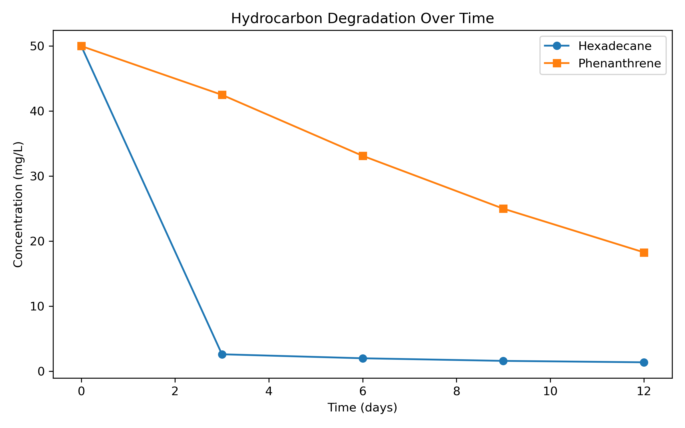
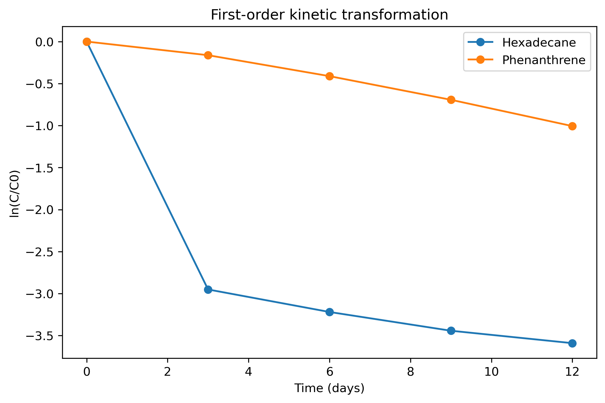

# GC-FID Hydrocarbon Degradation Kinetics

A Python-based analysis pipeline for modeling and comparing hydrocarbon 
degradation kinetics using GC-FID time-series data. This project reproduces 
and analyses degradation trends for an aliphatic alkane (hexadecane) and a 
polycyclic aromatic hydrocarbon (phenanthrene), based on published 
experimental data from Gulumbe, Cravo-Laureau & Duran (2025).

---

## Project Overview

This repository demonstrates an end-to-end analytical chemistry workflow:

- Structured data handling of GC-FID time-series measurements
- Scientific visualisation of degradation dynamics
- First-order kinetic modelling
- Parameter estimation — rate constants and half-lives
- Interpretation of differential biodegradation behaviour

The goal is to simulate a realistic environmental chemistry data pipeline 
that can be extended directly to real experimental GC-FID datasets.

---

## Scientific Context

Hydrocarbon degradation depends strongly on molecular structure.

| Compound       | Class                | Degradation pathway                | Expected rate |
|---------------|---------------------|-----------------------------------|---------------|
| Hexadecane    | Linear alkane (C16) | Alkane monooxygenase (alkB)       | Rapid         |
| Phenanthrene  | 3-ring PAH          | Dioxygenase activation            | Slower        |

This structural and enzymatic distinction predicts faster degradation of 
hexadecane relative to phenanthrene, which is tested quantitatively in the 
kinetic analysis below.

The reference study (Gulumbe et al., 2025) used a synthetic marine 
*Actinomycetota* consortium comprising *Rhodococcus* sp. 1Y, *Gordonia* sp. 
BP1o, and two *Janibacter indicus* strains isolated from hydrocarbon-
contaminated marine sediments. Both compounds were supplied at **50 mg/L** 
as sole carbon sources.

**Published outcomes over 12 days:**
- Hexadecane: ~97% degradation (residual 2.76%)
- Phenanthrene: ~63% degradation (residual 36.56%)

This project reconstructs those degradation trends and applies first-order 
kinetic analysis to quantify and compare the two degradation pathways.

---

## Results

### Degradation Dynamics

Hexadecane shows rapid early depletion within the first three days, 
while phenanthrene decreases more gradually — consistent with the 
metabolic complexity of aromatic ring activation compared to aliphatic 
chain oxidation.

### First-Order Kinetic Transformation

Linearisation of ln(C/C₀) versus time highlights the steeper slope for 
hexadecane, confirming a significantly higher degradation rate constant 
relative to phenanthrene.

### Estimated Kinetic Parameters

| Compound       | k (day⁻¹) | Half-life (days) | R²    |
|---------------|----------|------------------|-------|
| Hexadecane    | 0.256    | 2.71             | 0.658 |
| Phenanthrene  | 0.085    | 8.18             | 0.987 |

Note on hexadecane R²: The lower R² reflects rapid early depletion followed 
by a plateau near detection limits, indicating that a single-phase 
first-order model is insufficient to fully capture the degradation dynamics.

---

## Methods

Python stack:

- pandas — structured data handling  
- numpy — numerical calculations  
- matplotlib — scientific visualisation  
- scipy — linear regression and kinetic fitting  

First-order degradation model:

C(t) = C₀ · e^(−kt)

Linearised form:
ln(C / C₀) = −kt

Half-life:
t½ = ln(2) / k

where:
- C(t) = concentration at time t (mg/L)  
- C₀ = initial concentration (mg/L)  
- k = first-order rate constant (day⁻¹)  
- t½ = half-life (days)  

Linear regression is applied to ln(C/C₀) versus time using 
scipy.stats.linregress to estimate k and assess goodness of fit (R²).

---

## Repository Structure

gcfid-hydrocarbon-degradation/
│
├── gcfid_degradation_kinetics.ipynb
├── kinetic_summary.csv
├── requirements.txt
│
├── figures/
│ ├── degradation_curves.png
│ └── first_order_kinetics.png
│
└── data/
└── synthetic_gulumbe_data.csv

---

## Data Note

The dataset used here is reconstructed from published figures in 
Gulumbe et al. (2025) and is not raw GC-FID instrument output.

This project demonstrates:
- Data reconstruction from peer-reviewed literature  
- Reproducible analysis pipelines  
- Kinetic modelling under realistic experimental constraints  

The pipeline is designed to accept real GC-FID data without structural changes.

---

## Why This Project Matters

This project demonstrates the ability to move from literature-derived data 
to a reproducible kinetic modeling pipeline in Python.

It reflects:
- Translation of experimental chemistry into computational workflows  
- Mechanistic understanding of hydrocarbon biodegradation  
- Handling of imperfect real-world data  
- Clear communication of quantitative scientific results  

These skills are directly transferable to environmental data analysis, 
analytical chemistry, and environmental monitoring roles.

---

## Reference

Gulumbe, B.H., Cravo-Laureau, C. & Duran, R. (2025). Integrative genomic 
and transcriptomic analyses reveal marine *Actinomycetota* adaptations for 
hydrocarbon degradation. Environmental Technology & Innovation, 40, 104361.  
https://doi.org/10.1016/j.etinno.2025.104361

---

## Author

Emma McCallum  
Environmental Analytical Chemistry & Microbiology  
GREEN Graduate Programme — IPREM CNRS UMR 5254  
Université de Pau et des Pays de l'Adour, France  

LinkedIn: https://linkedin.com/in/ecmccallum  
GitHub: https://github.com/ecmccallum

---

Part of ongoing research into hydrocarbon bioremediation and microbial 
ecology at IPREM CNRS. This repository will be updated with experimental 
data as the research progresses.
